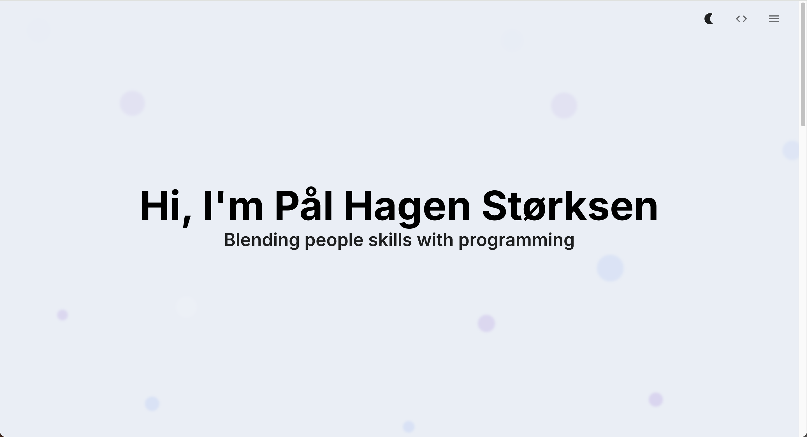

# ✨ Portfolio Site



A modern portfolio website built with [Next.js](https://nextjs.org/), [React](https://react.dev/), and [TypeScript](https://www.typescriptlang.org/). Showcases projects, skills, and contact information with a sleek, responsive design.

## Features

- ⚡ Built on Next.js for fast, SEO-friendly static site generation
- 🎨 Responsive and accessible UI, mobile-ready out of the box
- 🔒 Type-safe codebase with TypeScript
- 🧩 Modular React components for easy customization
- 💼 Project and skills showcase
- 🌗 Dark mode support
- 🚀 Deployed to Vercel, Netlify or any static host

## Getting Started

### Prerequisites

- [Node.js](https://nodejs.org/) (v16 or later recommended)
- [npm](https://www.npmjs.com/) (or [yarn](https://yarnpkg.com/), [pnpm](https://pnpm.io/), or [bun](https://bun.sh/) can also be used)

### Installation

Clone the repository:

```bash
git clone https://github.com/paalHagen/portfolio-site.git
cd portfolio-site
```

Install dependencies:

```bash
npm install
```

### Running Locally

Start the development server:

```bash
npm run dev
```

Visit [http://localhost:3000](http://localhost:3000) in your browser to see your portfolio.

### Building for Production

```bash
npm run build
npm start
```

## Project Structure

```
portfolio-site/
├── app/                                 # Main application folder
│   ├── components/                      # Reusable React components
│   │   ├── FadeInOnScroll.tsx
│   │   ├── FloatingBubbles.tsx
│   │   ├── NavBar.tsx
│   │   ├── ProjectCard.tsx
│   │   ├── RollingText.tsx
│   │   ├── StackSelector.tsx
│   │   └── ThemeRegistry.tsx
│   ├── context/                         # React context providers
│   │   ├── PortfolioContext.tsx
│   │   └── ThemeContext.tsx
│   ├── layout.tsx                       # App layout
│   └── page.tsx                         # Main page entry
├── public/                              # Assets (static)
│   └── profile_img.png
├── styles/                              # Global styles
│   └── globals.css
├── .gitignore
├── eslint.config.mjs                    # ESLint configuration
├── next.config.ts                       # Next.js configuration
├── package-lock.json                    # npm lockfile
├── package.json                         # Project metadata and scripts
├── README.md                            # Project documentation
└── tsconfig.json                        # TypeScript configuration
```

## Customization

Edit the content directly in the components and context files under `/app/components/` and `/app/context/`:

- Update your bio, introduction, and contact info in `page.tsx` and related components.
- Add or modify projects in the sample project data in `page.tsx`.
- Adjust skills and technologies in `StackSelector.tsx`.
- Update social links in `NavBar.tsx`.

See comments in each file for guidance.

## Deployment

Deploy easily to cloud platforms like [Vercel](https://vercel.com/) (recommended for Next.js), [Netlify](https://www.netlify.com/), or your preferred host.

### Deploy to Vercel

1. Push your repository to GitHub.
2. Import your repository into Vercel.
3. Configure any environment variables if needed.
4. Deploy!

> Crafted with ❤️ using Next.js, React, and TypeScript.
